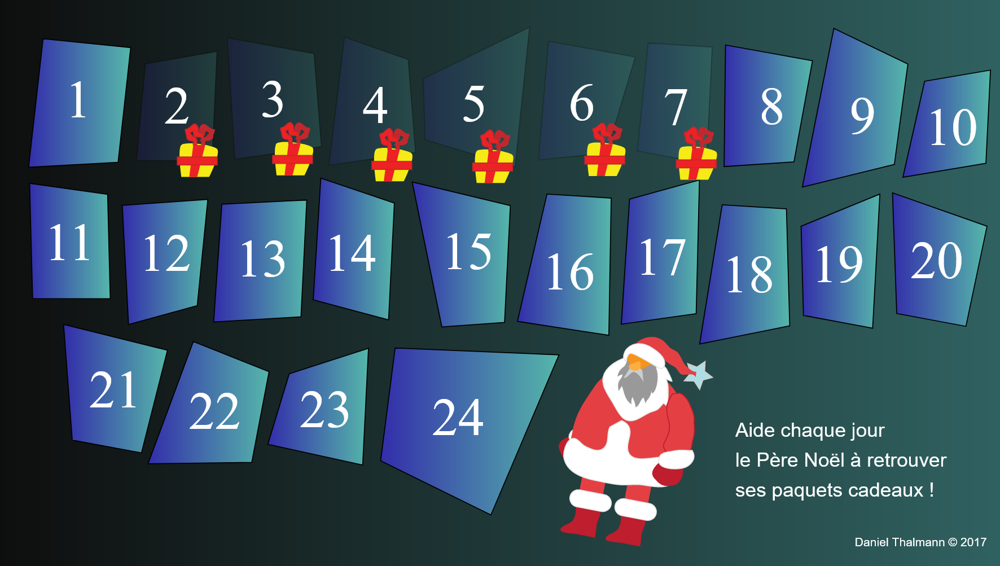

# Santaclaus Game

Petit calendrier de l'avant qui a été réalisé en 2017.

## installation

Pour pouvoir utiliser le jeu il faut PHP. Celui-ci est utilisé pour minifier les fichier js
```
cd src/
composer install
php -S localhost:3000
```

Ouvrir un navigateur à l'adresse http://localhost:3000 pour pouvoir jouer

## capture d'écran

### Menu



### Niveau en jeu


